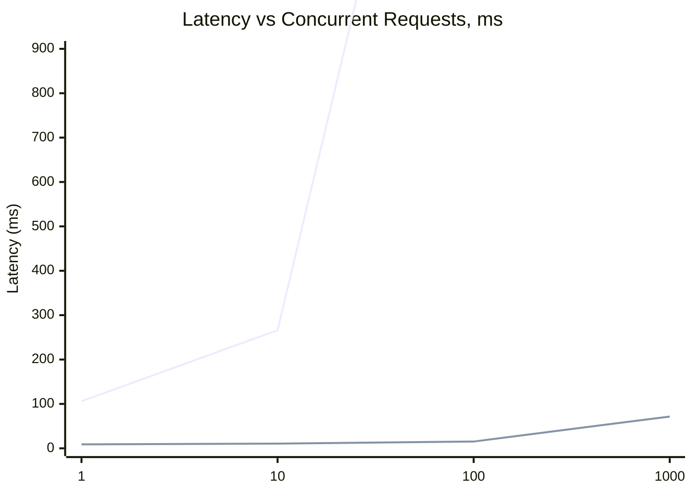
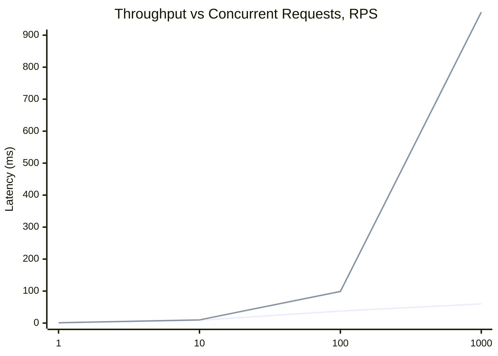

# Research how indexes affect performance
## Task

1. Generate 1,000,000 profiles by any means. First and Last names must be real to account for index selectivity. You can also use an existing list as a basis.

2. Implement functionality to search profiles by first name and last name prefix (simultaneously) in your social network (implement the `/user/search` method from the specification) (query in the form `firstName LIKE ? and secondName LIKE ?`). Sort the output by profile id.

3. Conduct load tests for this method. Experiment with the number of concurrent requests: 1/10/100/1000.

4. Build graphs and save them in the report.

5. Create a suitable index.

6. Repeat steps 3 and 4.

7. As a result, provide a report that must include:

- Latency graphs before the index;
- Throughput graphs before the index;
- Latency graphs after the index;
- Throughput graphs after the index;
- The index creation query;
- Explain queries after the index;
- Explanation of why this particular index was chosen.

## Solution
### How to right tests
In a root folder run:
```shell
 k6 run --vus 1 --duration 30s -e TOKEN=019ad610-78ed-7e30-83da-d876f019faef load_testing/user_search.js
```
```shell
 k6 run --vus 10 --duration 30s -e TOKEN=019ad610-78ed-7e30-83da-d876f019faef load_testing/user_search.js
```
```shell
 k6 run --vus 100 --duration 30s -e TOKEN=019ad610-78ed-7e30-83da-d876f019faef load_testing/user_search.js
```
```shell
 k6 run --vus 1000 --duration 30s -e TOKEN=019ad610-78ed-7e30-83da-d876f019faef load_testing/user_search.js
```
p(95) displayed on XY graphs below

### B-tree for queries LIKE "<query>%"

```postgresql
CREATE INDEX idx_profile_name_composite ON profiles (first_name varchar_pattern_ops, second_name varchar_pattern_ops);
CREATE INDEX idx_profile_last_name ON profiles (second_name varchar_pattern_ops);
```






#### Explain
```postgresql
SELECT *
FROM profiles
WHERE first_name LIKE 'Абра%';
```

```json
[
  {
    "Plan": {
      "Node Type": "Bitmap Heap Scan",
      "Parallel Aware": false,
      "Async Capable": false,
      "Relation Name": "profiles",
      "Alias": "profiles",
      "Startup Cost": 257.57,
      "Total Cost": 17347.94,
      "Plan Rows": 17714,
      "Plan Width": 91,
      "Filter": "((first_name)::text ~~ 'Абра%'::text)",
      "Plans": [
        {
          "Node Type": "Bitmap Index Scan",
          "Parent Relationship": "Outer",
          "Parallel Aware": false,
          "Async Capable": false,
          "Index Name": "idx_profile_name_composite",
          "Startup Cost": 0.00,
          "Total Cost": 253.15,
          "Plan Rows": 17672,
          "Plan Width": 0,
          "Index Cond": "(((first_name)::text ~>=~ 'Абра'::text) AND ((first_name)::text ~<~ 'Абрб'::text))"
        }
      ]
    }
  }
]
```

```postgresql
SELECT *
FROM profiles
WHERE second_name LIKE 'Тим%';
```

```json
[
  {
    "Plan": {
      "Node Type": "Bitmap Heap Scan",
      "Parallel Aware": false,
      "Async Capable": false,
      "Relation Name": "profiles",
      "Alias": "profiles",
      "Startup Cost": 257.06,
      "Total Cost": 17413.68,
      "Plan Rows": 18442,
      "Plan Width": 91,
      "Filter": "((second_name)::text ~~ 'Тим%'::text)",
      "Plans": [
        {
          "Node Type": "Bitmap Index Scan",
          "Parent Relationship": "Outer",
          "Parallel Aware": false,
          "Async Capable": false,
          "Index Name": "idx_profile_last_name",
          "Startup Cost": 0.00,
          "Total Cost": 252.45,
          "Plan Rows": 18402,
          "Plan Width": 0,
          "Index Cond": "(((second_name)::text ~>=~ 'Тим'::text) AND ((second_name)::text ~<~ 'Тин'::text))"
        }
      ]
    }
  }
]
```

```postgresql
SELECT *
FROM profiles
WHERE first_name LIKE 'Абра%' AND second_name LIKE 'Тим%';

```

```json
[
  {
    "Plan": {
      "Node Type": "Bitmap Heap Scan",
      "Parallel Aware": false,
      "Async Capable": false,
      "Relation Name": "profiles",
      "Alias": "profiles",
      "Startup Cost": 341.58,
      "Total Cost": 1457.41,
      "Plan Rows": 314,
      "Plan Width": 91,
      "Filter": "(((first_name)::text ~~ 'Абра%'::text) AND ((second_name)::text ~~ 'Тим%'::text))",
      "Plans": [
        {
          "Node Type": "Bitmap Index Scan",
          "Parent Relationship": "Outer",
          "Parallel Aware": false,
          "Async Capable": false,
          "Index Name": "idx_profile_name_composite",
          "Startup Cost": 0.00,
          "Total Cost": 341.50,
          "Plan Rows": 312,
          "Plan Width": 0,
          "Index Cond": "(((first_name)::text ~>=~ 'Абра'::text) AND ((first_name)::text ~<~ 'Абрб'::text) AND ((second_name)::text ~>=~ 'Тим'::text) AND ((second_name)::text ~<~ 'Тин'::text))"
        }
      ]
    }
  }
]
```

#### Reason to use B-TREE varchar_pattern_ops index 
For request like "<query>%" B-TREE index works properly and 
other types of indexes (like GIN) are redundant. 
Fulltext index is not good in this case, because it is not supposed to work with substrings. 

### Performance Improvement Summary

| Concurrent Users | Latency Improvement | Throughput Improvement |
|------------------|---------------------|------------------------|
| 1                | 12x faster          | 10% better             |
| 10               | 25x faster          | 12% better             |
| 100              | 139x faster         | 163% better            |
| 1000             | 303x faster         | 1520% better           |