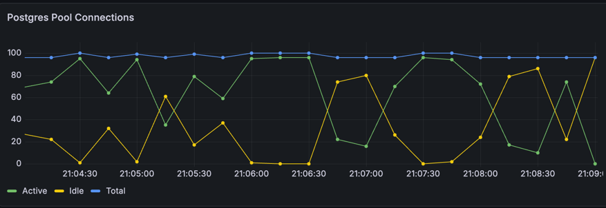
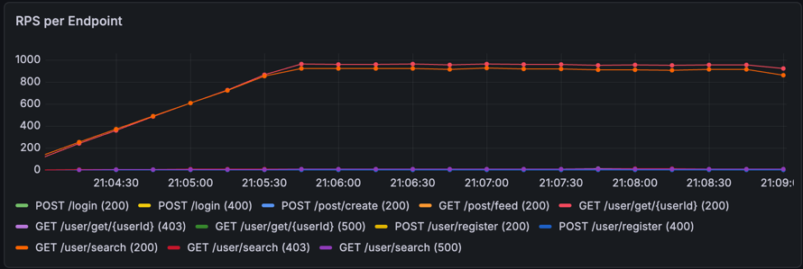
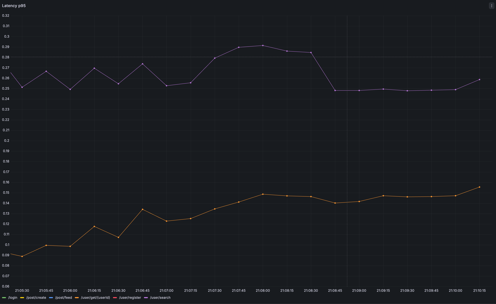
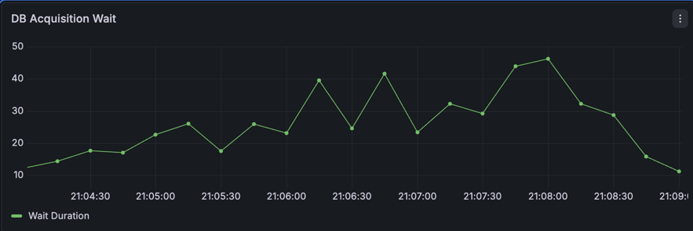

# Experiment -  replication

## Step 1: read load

### Search random users 1k RPS for 5m

#### Report
     scenarios: (100.00%) 1 scenario, 1000 max VUs, 5m30s max duration (incl. graceful stop):
              * default: 1000 looping VUs for 5m0s (gracefulStop: 30s)

     ✗ status is 200                                                                                                                                                                                                                                          
      ↳  98% — ✓ 275637 / ✗ 4882

     checks.........................: 98.25% 275637 out of 280519
     data_received..................: 4.2 GB 14 MB/s
     data_sent......................: 59 MB  196 kB/s
     http_req_blocked...............: avg=106.19µs min=1µs   med=2µs     max=63.42ms  p(90)=3µs      p(95)=4µs     
     http_req_connecting............: avg=94.39µs  min=0s    med=0s      max=40.15ms  p(90)=0s       p(95)=0s      
     http_req_duration..............: avg=70.82ms  min=788µs med=19.23ms max=5.38s    p(90)=157.77ms p(95)=258.55ms
       { expected_response:true }...: avg=70.59ms  min=788µs med=18.68ms max=5.38s    p(90)=157.51ms p(95)=259.31ms
     http_req_failed................: 1.74%  4882 out of 280519
     http_req_receiving.............: avg=518.84µs min=11µs  med=198µs   max=109.38ms p(90)=1.18ms   p(95)=1.93ms  
     http_req_sending...............: avg=23.51µs  min=3µs   med=8µs     max=14ms     p(90)=14µs     p(95)=18µs    
     http_req_tls_handshaking.......: avg=0s       min=0s    med=0s      max=0s       p(90)=0s       p(95)=0s      
     http_req_waiting...............: avg=70.28ms  min=753µs med=18.65ms max=5.38s    p(90)=157.27ms p(95)=257.63ms
     http_reqs......................: 280519 930.863059/s
     iteration_duration.............: avg=1.07s    min=1s    med=1.01s   max=6.38s    p(90)=1.15s    p(95)=1.25s   
     iterations.....................: 280519 930.863059/s
     vus............................: 181    min=181              max=1000
     vus_max........................: 1000   min=1000             max=1000

running (5m01.4s), 0000/1000 VUs, 280519 complete and 0 interrupted iterations
default ✓ [======================================] 1000 VUs  5m0s

### Get random users 1k RPS for 5m

#### Report 

     scenarios: (100.00%) 1 scenario, 1000 max VUs, 5m30s max duration (incl. graceful stop):
              * default: 1000 looping VUs for 5m0s (gracefulStop: 30s)

WARN[0000] Error from API server                         error="listen tcp 127.0.0.1:6565: bind: address already in use"

     ✗ status is 200                                                                                                                                                                                                                                          
      ↳  98% — ✓ 288130 / ✗ 4452

     checks.........................: 98.47% 288130 out of 292582
     data_received..................: 83 MB  277 kB/s
     data_sent......................: 61 MB  204 kB/s
     http_req_blocked...............: avg=211.12µs min=1µs   med=2µs    max=138.25ms p(90)=4µs     p(95)=4µs     
     http_req_connecting............: avg=186.22µs min=0s    med=0s     max=117.03ms p(90)=0s      p(95)=0s      
     http_req_duration..............: avg=26.56ms  min=505µs med=8.21ms max=687.38ms p(90)=72.2ms  p(95)=125.47ms
       { expected_response:true }...: avg=25.7ms   min=505µs med=8.02ms max=687.38ms p(90)=68.61ms p(95)=122.4ms 
     http_req_failed................: 1.52%  4452 out of 292582
     http_req_receiving.............: avg=25.25µs  min=7µs   med=20µs   max=36.7ms   p(90)=37µs    p(95)=53µs    
     http_req_sending...............: avg=35.74µs  min=3µs   med=8µs    max=77.53ms  p(90)=14µs    p(95)=19µs    
     http_req_tls_handshaking.......: avg=0s       min=0s    med=0s     max=0s       p(90)=0s      p(95)=0s      
     http_req_waiting...............: avg=26.5ms   min=484µs med=8.18ms max=687.35ms p(90)=72.11ms p(95)=125.39ms
     http_reqs......................: 292582 972.000652/s
     iteration_duration.............: avg=1.02s    min=1s    med=1s     max=1.68s    p(90)=1.07s   p(95)=1.12s   
     iterations.....................: 292582 972.000652/s
     vus............................: 143    min=143              max=1000
     vus_max........................: 1000   min=1000             max=1000

running (5m01.0s), 0000/1000 VUs, 292582 complete and 0 interrupted iterations
default ✓ [======================================] 1000 VUs  5m0s

### Grafana

## Step 2: Add 1 master - 2 slaves
- read from slace 
- write to master

